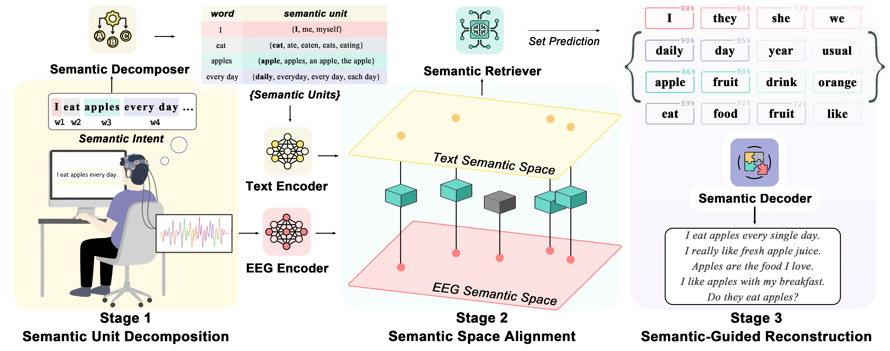

<p align="center">
  
</p>

<p align="center">
  <b>BrainMosaic-SID</b><br/>
  Assembling the Mind's Mosaic: Towards EEG Semantic Intent Decoding
</p>

<p align="center">
  <a href="https://arxiv.org/abs/2601.20447">
    
  </a>
  <a href="https://openreview.net/forum?id=8OgJ2uhiu8">
    
  </a>
</p>

<p align="center">
  <sub>Public code release with config-driven training, decoupled reconstruction, and sanitized data interfaces.</sub>
</p>

<p align="center">
  
</p>

## Overview

BrainMosaic-SID is a semantic intent decoding framework that maps EEG/SEEG signals to:

1. semantic unit sets in a continuous text space
2. sentence-level intent attributes
3. standalone LLM-based sentence reconstruction


## Repository Highlights

- Core model training/evaluation: `main.py`, `models/`, `datasets/`, `engine.py`
- Config-driven runs: `configs/train.example.json`
- Decoupled sentence reconstruction: `semantic_guided_decoder/sen_llm.py`
- Simplified public text-side pipeline:
  - embedding generation: `labels/gen_embedding.py`
  - token-bank clustering: `labels/emb_preprocessing.py`

## Install

```bash
pip install -r requirements.txt
```

## Quick Start

### 1. Build text assets

Generate sentence/token embeddings:

```bash
cp configs/text_embedding.example.json configs/text_embedding.json
python labels/gen_embedding.py --config configs/text_embedding.json
```

Build token bank (`embeddings.pt`, `map.json`, `info.json`):

```bash
cp configs/token_bank.example.json configs/token_bank.json
python labels/emb_preprocessing.py --config configs/token_bank.json
```

### 2. Train / Eval BrainMosaic-SID

```bash
cp configs/train.example.json configs/train.json
python main.py --config configs/train.json
```

Unified EEG input is required. `data.eeg_path` should contain:

- `train.pt`
- `val.pt`

Each split file must be a list of records:

```json
{
  "eeg": "... 2D array/tensor [C,T] or [T,C] ...",
  "sentence": "raw sentence text",
  "words": ["semantic", "units"],
  "sentence_mode": 0,
  "subjectivity": 0,
  "semantic_focus": 0
}
```

`words/sentence_mode/subjectivity/semantic_focus` can be omitted only if `segmentation_path` provides them.

CLI overrides are supported:

```bash
python main.py --config configs/train.json --batch_size 16 --epochs 20
```

### 3. LLM Reconstruction

```bash
cp configs/reconstruct.example.json configs/reconstruct.json
python semantic_guided_decoder/sen_llm.py --config configs/reconstruct.json
```


## Citation

```bibtex
@inproceedings{li2026brainmosaic,
  title={Assembling the Mind's Mosaic: Towards EEG Semantic Intent Decoding},
  author={Li, Jiahe and Chen, Junru and Shen, Fanqi and Yang, Jialan and Li, Jada and Yuan, Zhizhang and Cheng, Baowen and Li, Meng and Yang, Yang},
  booktitle={The Fourteenth International Conference on Learning Representations},
  year={2026}
}
```
